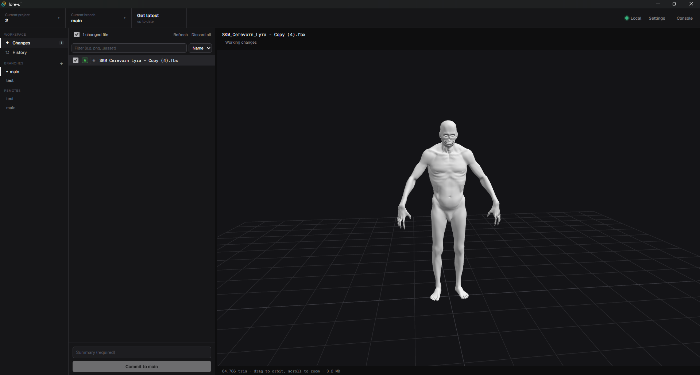

# Lore UI


> [!WARNING]
> **Work in Progress**: This project is currently under active development and is not yet finished. Features may change or be incomplete.

A desktop GUI for the [Lore](https://epicgames.github.io/lore/) version control system - a clean, GitHub-Desktop-style client built with Tauri and TypeScript.

### Why Lore UI?
Lore ships as a CLI only. Lore UI was designed to allow designers to easily use Lore alongside developers, wrapping the powerful command set of the Lore CLI from Epic into a compact, grayscale interface so common work is just a click away.

## Features

- **Workspace** - see changed files, stage and commit, push and get latest, switch and create branches, merge.
- **History** - browse commits, view a commit's file changes and line diffs, revert a commit, or undo the latest one.
- **Diffs** - per-file line diffs for working changes and past commits, colour-coded (add green, change orange, remove red).
- **Discard** - drop working changes per file, including brand-new files.
- **Server control** - shows local/remote server type and status; auto-starts a local `loreserver` when the address is local, with Start/Stop controls.
- **Settings** - global lore flags (data source, offline, force, dry-run, identity, log level, limits) applied to every command.
- **Console** - run any lore command with full output, with a browsable list of all commands.

## How it works

The Tauri (Rust) backend shells out to the `lore` CLI and parses its text output into structured data for the TypeScript frontend. Lore has no JSON output, so every parser was built against real CLI output.

## Requirements

- The `lore` CLI on your `PATH` (and `loreserver` for local hosting).
- [Rust](https://www.rust-lang.org/) and [Node.js](https://nodejs.org/) to build.

## Develop

```bash
npm install
npm run tauri dev
```

## Build

```bash
npm run tauri build
```
